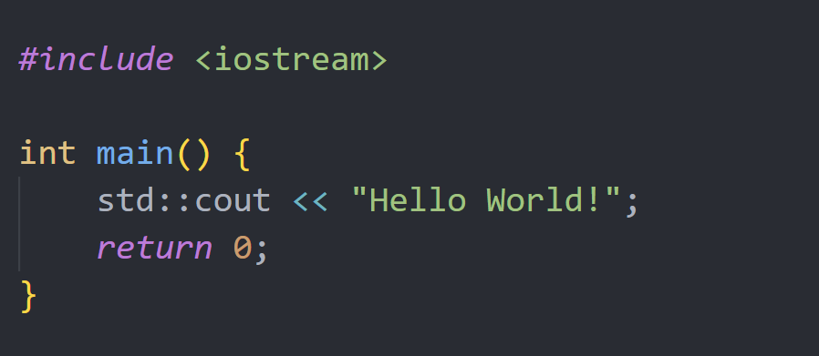

# General info about my project

This is a list:
- item 1
- item 2
- item 3

Ordered list:
1. item1
2. item2
3. item3

> quote

This is a code example:
```py
import pandas as pd
import csv
import MyClass

obj = MyClass('test.txt')
print(obj.test())
```


